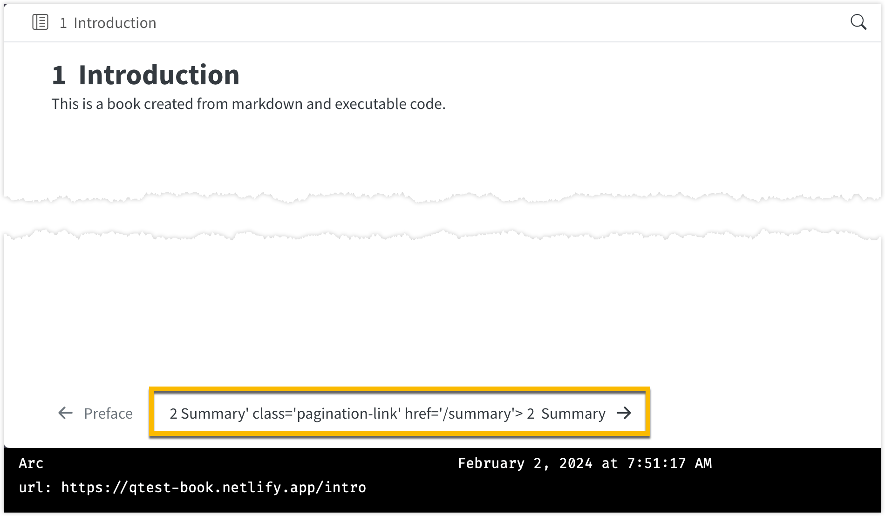

# qtest-book

Test book to troubleshoot issue I'm having with nav-page-next button published with Quarto GHA.

Live site: <https://qtest-book.netlify.app/>

## Problem

With the current default publish action (uses exact text from [publish action](https://quarto.org/docs/publishing/netlify.html#publish-action) section of Quarto docs on publishing with Netlify), the arrow for moving to the pagination link for the next page is broken (seems to have the some of the HTML spliced into the name).

The [publish.yml](https://github.com/batpigandme/qtest-book/blob/main/.github/workflows/publish.yml) for this book uses the defaults (latest released version of Quarto), and displays this problem.
It only happens for the link to the *next* section, the link for the *previous* section is fine (see, e.g. <https://qtest-book.netlify.app/intro>).

The screenshot below shows the live [preface page for this book](https://qtest-book.netlify.app/) with the problem.

{fig-alt="Screenshot of test book preface page with broken pagination link—the text for the pagination link includes html class and href and is not a live link."}
